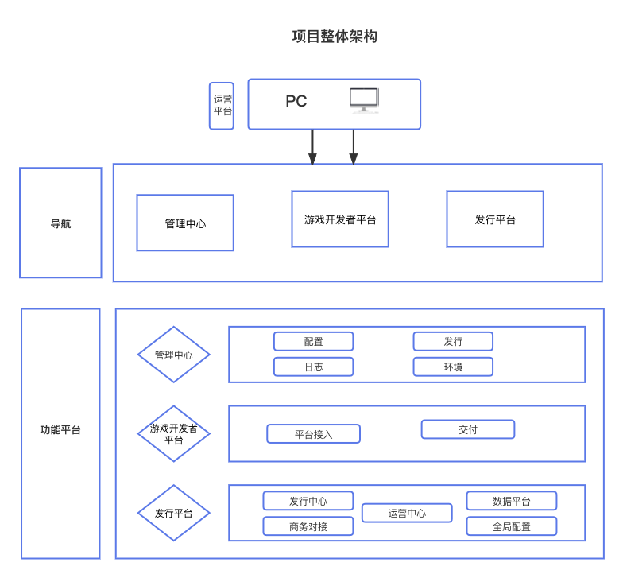

# 项目架构总览

## 管理中心

:::info{title=项目信息}
- 项目简介：管理中心是综合管理CPSDK和发行SDK全局配置的平台，SDK管理人员可通过管理中心对多个发行SDK平台进行集中管理和配置。
- 项目仓库地址：[管理中心仓库](http://git.iwgame.com/sdk/sdk-webmin/admin-webmin-web)&emsp;http://git.iwgame.com/sdk/sdk-webmin/admin-webmin-web
- 功能模块：
  - 配置管理
    - [游戏管理](http://admin-webmin-dev.iwgame.com/setting/gameManage)&emsp;http://admin-webmin-dev.iwgame.com/setting/gameManage
    - [签名管理](http://admin-webmin-dev.iwgame.com/setting/signNameManage)&emsp;http://admin-webmin-dev.iwgame.com/setting/signNameManage
  - 环境配置
    - [服务组管理](http://admin-webmin-dev.iwgame.com/envConfig/sdkServiceManage)&emsp;http://admin-webmin-dev.iwgame.com/envConfig/sdkServiceManage
    - [区服组管理](http://admin-webmin-dev.iwgame.com/envConfig/zone)&emsp;http://admin-webmin-dev.iwgame.com/envConfig/zone
    - [通道管理](http://admin-webmin-dev.iwgame.com/envConfig/tunnelManage)&emsp;http://admin-webmin-dev.iwgame.com/envConfig/tunnelManage
    - [通道包管理](http://admin-webmin-dev.iwgame.com/envConfig/tunnelAppMakerManage)&emsp;http://admin-webmin-dev.iwgame.com/envConfig/tunnelAppMakerManage
  - 发行配置
    - [发行商管理](http://admin-webmin-dev.iwgame.com/release/publishBusiness)&emsp;http://admin-webmin-dev.iwgame.com/release/publishBusiness
    - [渠道商管理](http://admin-webmin-dev.iwgame.com/release/ChannelConfig)&emsp;http://admin-webmin-dev.iwgame.com/release/ChannelConfig
    - [发行平台管理](http://admin-webmin-dev.iwgame.com/release/publishPlatform)&emsp;http://admin-webmin-dev.iwgame.com/release/publishPlatform
    - [支付方式管理](http://admin-webmin-dev.iwgame.com/release/payMethod)&emsp;http://admin-webmin-dev.iwgame.com/release/payMethod
    - [支付供应商管理](http://admin-webmin-dev.iwgame.com/release/paySupplier)&emsp;http://admin-webmin-dev.iwgame.com/release/paySupplier
  - 日志查询
    - [游戏订单查询](http://admin-webmin-dev.iwgame.com/log/gameOrder)&emsp;http://admin-webmin-dev.iwgame.com/log/gameOrder
    - [登陆日志查询](http://admin-webmin-dev.iwgame.com/log/loginLog)&emsp;http://admin-webmin-dev.iwgame.com/log/loginLog
    - [补单查询](http://admin-webmin-dev.iwgame.com/log/helpOrder)&emsp;http://admin-webmin-dev.iwgame.com/log/helpOrder
  - Runner管理
    - [Runner](http://admin-webmin-dev.iwgame.com/runner/runnerList)&emsp;http://admin-webmin-dev.iwgame.com/runner/runnerList
    - [作业](http://admin-webmin-dev.iwgame.com/runner/homeWork)&emsp;http://admin-webmin-dev.iwgame.com/runner/homeWork
- 入口&环境：
  - [UAT环境](https://admin-webmin-uat.iwgame.com/)&emsp;https://admin-webmin-uat.iwgame.com/
  - [正式环境](https://admin-webmin.iwgame.com/)&emsp;https://admin-webmin.iwgame.com/
  - [测试环境](http://admin-webmin-dev.iwgame.com/)&emsp;http://admin-webmin-dev.iwgame.com/
  - [原型地址](https://lanhuapp.com/web/#/item/project/product?tid=8a6b861a-118c-413b-87e4-c08441589160&pid=03af00f5-ef30-4819-bf85-13bf4d84c68e&versionId=69dea6bd-5d14-4387-a2ba-54a9eca3a0f3&docId=ab7b8dbb-a221-4dc8-8993-1373415ccab9&docType=axure&pageId=481ea7a4511542b89abda8909e275f25&image_id=ab7b8dbb-a221-4dc8-8993-1373415ccab9)&emsp;https://lanhuapp.com/web/#/item/project/product?tid=8a6b861a-118c-413b-87e4-c08441589160&pid=03af00f5-ef30-4819-bf85-13bf4d84c68e&versionId=69dea6bd-5d14-4387-a2ba-54a9eca3a0f3&docId=ab7b8dbb-a221-4dc8-8993-1373415ccab9&docType=axure&pageId=481ea7a4511542b89abda8909e275f25&image_id=ab7b8dbb-a221-4dc8-8993-1373415ccab9
:::

:::info{title=业务名词解释}

| 业务名词 | 名词解释 |
| - | ----  |
| 游戏  | 游戏研发需接入的游戏产品      |
| 区服组 | 游戏服务器组的集合      |
| CP-SDK  | CP：游戏研发（ContentProvider）游戏类型的SDK      |
| SDK服务组 | 直接面向游戏登录支付请求的一整套SDK服务。CP-SDK后台可以存在多个SDK服务组，与区服组为一一对应关系，新建区服组时选择      |
| 发行商 | 帮助游戏研发经营游戏产品，根据游戏产品特色和测试数据，制定市场宣传计划和营销策略，将经费投入各渠道平台以获取更多的用户，让游戏产品达到更高的高度      |
| 通道 | 区服组和发行商的关联关系，“A游戏产品由B发行商经营，需要用到C服务器组”      |
| 通道包 | CP-SDK最终提供到外部发行商的母包，包含外部发行商SDK账号及充值体系      |
| 渠道商 | 获取流量的来源，如巨量、快手、广点通等     |
| 支付方式 | 玩家需要充值付款可选择的支付途径。    |
| 支付供应商 | 支付供应商指第三方支付公司以较低的费率成本，获得微信、支付宝等支付通道使用权，提供可聚合多种支付方式的支付产品。    |

:::

:::info{title=模块功能说明}
- 配置管理
    - [游戏管理](http://admin-webmin-dev.iwgame.com/setting/gameManage)：管理接入绿岸CPSDK的游戏
    - [签名管理](http://admin-webmin-dev.iwgame.com/setting/signNameManage)：Android打包签名，用于自研外发场景出安卓通道包（当前SDK4.0暂无自研外发场景，功能暂未使用）
- 环境配置
  - [服务组管理](http://admin-webmin-dev.iwgame.com/envConfig/sdkServiceManage)：管理已部署完成的SDK服务组
  - [区服组管理](http://admin-webmin-dev.iwgame.com/envConfig/zone)：管理游戏下属的区服组列表，每个区服组生成一组CPSDK接入参数提供给游戏研发进行配置
  - [通道管理](http://admin-webmin-dev.iwgame.com/envConfig/tunnelManage)：管理游戏区服组下属的通道列表
  - [通道包管理](http://admin-webmin-dev.iwgame.com/envConfig/tunnelAppMakerManage)：管理CPSDK打出的通道包，用于自研外发场景（当前SDK4.0暂无自研外发场景，功能暂未使用，后续考虑迁移至游戏开发者平台）
- 发行配置
  - [发行商管理](http://admin-webmin-dev.iwgame.com/release/publishBusiness)：管理CPSDK已完成接入的发行商（需完成发行SDK接入）
  - [渠道商管理](http://admin-webmin-dev.iwgame.com/release/ChannelConfig)：管理发行SDK已完成接入的渠道商（需完成渠道SDK接入）
  - [发行平台管理](http://admin-webmin-dev.iwgame.com/release/publishPlatform)：通过管理中心进行集中管理配置的发行SDK平台以及相关配置管理。
  - [支付方式管理](http://admin-webmin-dev.iwgame.com/release/payMethod)：管理发行SDK已完成接入的支付方式，如支付宝/微信
  - [支付供应商管理](http://admin-webmin-dev.iwgame.com/release/paySupplier)：管理已完成介入的支付供应商。支付供应商指第三方支付公司以较低的费率成本，获得微信、支付宝等支付通道使用权，提供可聚合多种支付方式的支付产
品。（需事先完成支付供应商SDK接入）
- 日志查询
  - [游戏订单查询](http://admin-webmin-dev.iwgame.com/log/gameOrder)：查询CPSDK订单详情，纯展示，不可编辑（暂未使用）
  - [登陆日志查询](http://admin-webmin-dev.iwgame.com/log/loginLog)：查询CPSDK登录日志，纯展示，不可编辑（暂未使用）
  - [补单查询](http://admin-webmin-dev.iwgame.com/log/helpOrder)：查询CPSDK补单日志，纯展示，不可编辑（暂未使用）
- Runner管理
  - [Runner](http://admin-webmin-dev.iwgame.com/runner/runnerList):SDK技术人员使用，用于监控打包服务状态，及时发现&定位解决打包相关问题。
  - [作业](http://admin-webmin-dev.iwgame.com/runner/homeWork):查看打包日志。
:::
:::info{title=技术栈}
  - [ant design pro](https://pro.ant.design/zh-CN)
  - [antd](https://ant.design/index-cn)
  - [umijs](https://umijs.org/zh-CN/)
  - [内部npm](http://npm.iwgame.com/)
:::

*********************************************************************************************************************************************
## 游戏开发平台
:::info{title=项目信息}
- 项目简介：游戏开发者平台是协助游戏开发者接入绿岸SDK的平台，游戏开发者可通过平台获取所需接入的SDK以及接入参数，并在接入完成后自行打包测试SDK相关功
能。
- 项目仓库地址：[游戏开发平台仓库](http://git.iwgame.com/sdk/sdk-webmin/developer-webmin-web)&emsp;http://git.iwgame.com/sdk/sdk-webmin/developer-webmin-web
- 项目包含模块：
  - 平台接入
    - [SDK接入](http://cpsdk-open-dev.iwgame.com/debugging/sdkInsert)&emsp;http://cpsdk-open-dev.iwgame.com/debugging/sdkInsert
    - [SDK埋点检测](http://cpsdk-open-dev.iwgame.com/debugging/sdkPoint)&emsp;http://cpsdk-open-dev.iwgame.com/debugging/sdkPoint
    - [G数接入](http://cpsdk-open-dev.iwgame.com/debugging/GInsert)&emsp;http://cpsdk-open-dev.iwgame.com/debugging/GInsert
    - [G数埋点检测](http://cpsdk-open-dev.iwgame.com/debugging/GPoint)&emsp;http://cpsdk-open-dev.iwgame.com/debugging/GPoint
    - [日志查询](http://cpsdk-open-dev.iwgame.com/debugging/logQuery)&emsp;http://cpsdk-open-dev.iwgame.com/debugging/logQuery
  - 版本交付
    - [版本交付管理](http://cpsdk-open-dev.iwgame.com/versionGive/versionGiveConfig)&emsp;http://cpsdk-open-dev.iwgame.com/versionGive/versionGiveConfig
- 入口&环境：
  - [UAT环境](https://cpsdk-open-uat.iwgame.com/home)&emsp;https://cpsdk-open-uat.iwgame.com/home
  - [正式环境](https://cpsdk-open.iwgame.com/home)&emsp;https://cpsdk-open.iwgame.com/home
  - [测试/dev环境](http://cpsdk-open-dev.iwgame.com/home)&emsp;http://cpsdk-open-dev.iwgame.com/home
  - [原型地址](https://lanhuapp.com/web/#/item/project/product?tid=8a6b861a-118c-413b-87e4-c08441589160&pid=03af00f5-ef30-4819-bf85-13bf4d84c68e&versionId=e23507f1-6360-46b3-aac9-711b30f2bbf7&docId=2484d9b7-9f85-4a4e-b786-f0e0813f8618&docType=axure&pageId=1a38a0ca93ad44058bbc14d58ce46790&image_id=2484d9b7-9f85-4a4e-b786-f0e0813f8618)&emsp;https://lanhuapp.com/web/#/item/project/product?tid=8a6b861a-118c-413b-87e4-c08441589160&pid=03af00f5-ef30-4819-bf85-13bf4d84c68e&versionId=e23507f1-6360-46b3-aac9-711b30f2bbf7&docId=2484d9b7-9f85-4a4e-b786-f0e0813f8618&docType=axure&pageId=1a38a0ca93ad44058bbc14d58ce46790&image_id=2484d9b7-9f85-4a4e-b786-f0e0813f8618
:::

:::info{title=业务名词解释}

| 业务名词 | 名词解释 |
| :-: | :----:  |
|  G数 |   大数据平台   |

:::

:::info{title=模块功能说明}
- 平台接入
    - [SDK接入](http://cpsdk-open-dev.iwgame.com/debugging/sdkInsert)&emsp;新游戏需由SDK管理人员进行初始化操作 **前置条件：管理中心已完成SDK服务组配置**
    - [SDK埋点检测](http://cpsdk-open-dev.iwgame.com/debugging/sdkPoint)&emsp;该检测用于确认接入的G数日志是否可正确上报数据
    - [G数接入](http://cpsdk-open-dev.iwgame.com/debugging/GInsert)&emsp; 1.环境初始化说明 &emsp; 2.G数接入 &emsp; 3.埋点测试**前置条件：基础数据准备好测试G库&导入schema**
    - [G数埋点检测](http://cpsdk-open-dev.iwgame.com/debugging/GPoint)&emsp;该检测用于确认接入的G数日志是否可正确上报数据
    - [日志查询](http://cpsdk-open-dev.iwgame.com/debugging/logQuery)&emsp;查询游戏研发接入CPSDK上报的cpsdk日志（研发测试环境）
- 版本交付
  - [版本交付管理](http://cpsdk-open-dev.iwgame.com/versionGive/versionGiveConfig)&emsp;版本交付管理帮助游戏研发对提交的游戏版本进行统一规范管理。游戏研发可在游戏开发者后台上传待更新游戏服务端、游戏客户端、热更包文件，并填写
相关说明（版本号、版本代号、版本说明、运维操作说明），即可完成交付。
:::

:::info{title=技术栈}
  - [ant design pro](https://pro.ant.design/zh-CN)
  - [antd](https://ant.design/index-cn)
  - [umijs](https://umijs.org/zh-CN/)
  - [内部npm](http://npm.iwgame.com/)
:::

***************************************************************************************************************************
## 发行平台
:::info{title=项目信息}
项目简介：发行平台是集游戏子母包、渠道模版子母包、以及各种游戏信息统计、公司&项目信息统计的综合性运营平台。提供给运营对渠道，游戏子母包以及各种其他信息的操作和管理。
- 项目仓库地址：[发行平台仓库](http://git.iwgame.com/sdk/sdk-webmin/pubsdk-webmin-web)&emsp;http://git.iwgame.com/sdk/sdk-webmin/pubsdk-webmin-web
- 项目包含模块：
  - 发行中心
    - [子游戏管理](http://pubwebmin-dev.iwgame.com/release/gameConfig)&emsp;http://pubwebmin-dev.iwgame.com/release/gameConfig
    - [游戏母包管理](http://pubwebmin-dev.iwgame.com/release/gamePackage)&emsp;http://pubwebmin-dev.iwgame.com/release/gamePackage
    - [渠道包模版](http://pubwebmin-dev.iwgame.com/release/channelPackManage)&emsp;http://pubwebmin-dev.iwgame.com/release/channelPackManage
    - [投放包管理](http://pubwebmin-dev.iwgame.com/release/launchPackManage)&emsp;http://pubwebmin-dev.iwgame.com/release/launchPackManage
  - 运营中心
    - 账号服务管理
      - [注册登陆管理](http://pubwebmin-dev.iwgame.com/operationCenter/service/loginManage)&emsp;http://pubwebmin-dev.iwgame.com/operationCenter/service/loginManage
      - [协议管理](http://pubwebmin-dev.iwgame.com/operationCenter/service/agreeMentManage)&emsp;http://pubwebmin-dev.iwgame.com/operationCenter/service/agreeMentManage
    - 支付服务管理
      - [订单查询](http://pubwebmin-dev.iwgame.com/operationCenter/pay/orderQuery)&emsp;http://pubwebmin-dev.iwgame.com/operationCenter/pay/orderQuery
      - [补单日志](http://pubwebmin-dev.iwgame.com/operationCenter/service/loginManage)&emsp;http://pubwebmin-dev.iwgame.com/operationCenter/service/loginManage
      - [支付套件管理](http://pubwebmin-dev.iwgame.com/operationCenter/pay/payKITConfig)&emsp;http://pubwebmin-dev.iwgame.com/operationCenter/pay/payKITConfig
      - [支付套件切换](http://pubwebmin-dev.iwgame.com/operationCenter/pay/payConfig)&emsp;http://pubwebmin-dev.iwgame.com/operationCenter/pay/payConfig
    - 悬浮球管理
      - [悬浮球管理](http://pubwebmin-dev.iwgame.com/operationCenter/ball/ballConfig)&emsp;http://pubwebmin-dev.iwgame.com/operationCenter/ball/ballConfig
    - 商品管理
      - [游戏商品库](http://pubwebmin-dev.iwgame.com/operationCenter/goods/gameGoodsLibrary)&emsp;http://pubwebmin-dev.iwgame.com/operationCenter/goods/gameGoodsLibrary
      - [渠道商品配置](http://pubwebmin-dev.iwgame.com/operationCenter/goods/channelGoodsConfig)&emsp;http://pubwebmin-dev.iwgame.com/operationCenter/goods/channelGoodsConfig
    - 防沉迷管理
      - [防沉迷管理](http://pubwebmin-dev.iwgame.com/operationCenter/preventAddiction/loseManage)&emsp;http://pubwebmin-dev.iwgame.com/operationCenter/preventAddiction/loseManage
      - [节假日管理](http://pubwebmin-dev.iwgame.com/operationCenter/preventAddiction/holidayManage)&emsp;http://pubwebmin-dev.iwgame.com/operationCenter/preventAddiction/holidayManage
    - 实名认证管理
      - [公司管理](http://pubwebmin-dev.iwgame.com/operationCenter/realName/companyMamt)&emsp;http://pubwebmin-dev.iwgame.com/operationCenter/realName/companyMamt
      - [认证项目管理](http://pubwebmin-dev.iwgame.com/operationCenter/realName/authenticProjectMamt)&emsp;http://pubwebmin-dev.iwgame.com/operationCenter/realName/authenticProjectMamt
      - [实名认证查询](http://pubwebmin-dev.iwgame.com/operationCenter/realName/authenticUser)&emsp;http://pubwebmin-dev.iwgame.com/operationCenter/realName/authenticUser
      - [认证流水查询](http://pubwebmin-dev.iwgame.com/operationCenter/realName/certificationFlow)&emsp;http://pubwebmin-dev.iwgame.com/operationCenter/realName/certificationFlow
    - 查询工具
      - [账号查询](http://pubwebmin-dev.iwgame.com/operationCenter/operationTools/account-query)&emsp;http://pubwebmin-dev.iwgame.com/operationCenter/operationTools/account-query
      - [角色查询](http://pubwebmin-dev.iwgame.com/operationCenter/operationTools/role-query)&emsp;http://pubwebmin-dev.iwgame.com/operationCenter/operationTools/role-query
  - 全局配置
    - [项目管理](http://pubwebmin-dev.iwgame.com/globalConf/projectManage)&emsp;http://pubwebmin-dev.iwgame.com/globalConf/projectManage
    - [支付商户管理管理](http://pubwebmin-dev.iwgame.com/globalConf/payMerchant)&emsp;http://pubwebmin-dev.iwgame.com/globalConf/payMerchant
    - [iOS证书管理](http://pubwebmin-dev.iwgame.com/globalConf/iOSCertManagement)&emsp;http://pubwebmin-dev.iwgame.com/globalConf/iOSCertManagement
  - 商务对接
    - [外部商务登记](http://pubwebmin-dev.iwgame.com/business/busSign)&emsp;http://pubwebmin-dev.iwgame.com/business/busSign
    - [体验账号管理](http://pubwebmin-dev.iwgame.com/business/accountManage)&emsp;http://pubwebmin-dev.iwgame.com/business/accountManage
    - [内部商务管理](http://pubwebmin-dev.iwgame.com/business/inBusManage)&emsp;http://pubwebmin-dev.iwgame.com/business/inBusManage
    - [二维码下载](http://pubwebmin-dev.iwgame.com/business/QRDownload)&emsp;http://pubwebmin-dev.iwgame.com/business/QRDownload
  - 数据中心
    ..待开发
:::

:::info{title=名词解释}
| 业务名词 | 名词解释 |
| :-: | :----:  |
|  悬浮球 |   账号中心的入口   |

:::

:::info{title=模块功能说明}
- 发行中心
    - [子游戏管理](http://pubwebmin-dev.iwgame.com/release/gameConfig)&emsp;负责建立、编辑、统计子游戏
    - [游戏母包管理](http://pubwebmin-dev.iwgame.com/release/gamePackage)&emsp;建立游戏母包、统计、编辑
    - [渠道包模版](http://pubwebmin-dev.iwgame.com/release/channelPackManage)&emsp;新建渠道包模版和操作渠道包
    - [投放包管理](http://pubwebmin-dev.iwgame.com/release/launchPackManage)&emsp;建立渠道包并且将渠道包和渠道包模版关联起来并进行打包
  - 运营中心
    - 账号服务管理
      - [注册登陆管理](http://pubwebmin-dev.iwgame.com/operationCenter/service/loginManage)&emsp;当前项目下游戏的注册和登录操作
      - [协议管理](http://pubwebmin-dev.iwgame.com/operationCenter/service/agreeMentManage)&emsp;当前项目下游戏的协议操作
    - 支付服务管理
      - [订单查询](http://pubwebmin-dev.iwgame.com/operationCenter/pay/orderQuery)&emsp;游戏内道具商品订单管理
      - [补单日志](http://pubwebmin-dev.iwgame.com/operationCenter/service/loginManage)
      - [支付套件管理](http://pubwebmin-dev.iwgame.com/operationCenter/pay/payKITConfig)&emsp;游戏所使用支付方式管理
      - [支付套件切换](http://pubwebmin-dev.iwgame.com/operationCenter/pay/payConfig)&emsp;游戏里面支付方式切换
    - 悬浮球管理
      - [悬浮球管理](http://pubwebmin-dev.iwgame.com/operationCenter/ball/ballConfig)&emsp;账户入口
    - 商品管理
      - [游戏商品库](http://pubwebmin-dev.iwgame.com/operationCenter/goods/gameGoodsLibrary)&emsp;负责游戏里面的商品道具管理
      - [渠道商品配置](http://pubwebmin-dev.iwgame.com/operationCenter/goods/channelGoodsConfig)&emsp;各个渠道游戏的编辑和操作
    - 防沉迷管理
      - [防沉迷管理](http://pubwebmin-dev.iwgame.com/operationCenter/preventAddiction/loseManage)&emsp;游戏未成年防沉迷管理
      - [节假日管理](http://pubwebmin-dev.iwgame.com/operationCenter/preventAddiction/holidayManage)&emsp;节假日游戏管理
    - 实名认证管理
      - [公司管理](http://pubwebmin-dev.iwgame.com/operationCenter/realName/companyMamt)&emsp;公司
      - [认证项目管理](http://pubwebmin-dev.iwgame.com/operationCenter/realName/authenticProjectMamt)
      - [实名认证查询](http://pubwebmin-dev.iwgame.com/operationCenter/realName/authenticUser)&emsp;实名认证过的人游戏列表管理
      - [认证流水查询](http://pubwebmin-dev.iwgame.com/operationCenter/realName/certificationFlow)&emsp;认证结果查询
    - 查询工具
      - [账号查询](http://pubwebmin-dev.iwgame.com/operationCenter/operationTools/account-query)&emsp;当前游戏下账号查询的管理
      - [角色查询](http://pubwebmin-dev.iwgame.com/operationCenter/operationTools/role-query)&emsp;当前游戏下角色的管理
  - 全局配置
    - [项目管理](http://pubwebmin-dev.iwgame.com/globalConf/projectManage)&emsp;项目的操作和列表展示
    - [支付商户管理管理](http://pubwebmin-dev.iwgame.com/globalConf/payMerchant)&emsp;支付公司/商户支付信息管理
    - [iOS证书管理](http://pubwebmin-dev.iwgame.com/globalConf/iOSCertManagement)&emsp;游戏包所需ios 证书认证管理
  - 商务对接
    - [外部商务登记](http://pubwebmin-dev.iwgame.com/business/busSign)&emsp;公司外部商务信息管理
    - [体验账号管理](http://pubwebmin-dev.iwgame.com/business/accountManage)&emsp;内部体验账户的操作和管理
    - [内部商务管理](http://pubwebmin-dev.iwgame.com/business/inBusManage)&emsp;公司内部商务人员管理
    - [二维码下载](http://pubwebmin-dev.iwgame.com/business/QRDownload)&emsp;生成和下载二维码平台
  - 数据中心
    ..待开发
:::

:::info{title=技术栈}
  - [ant design pro](https://pro.ant.design/zh-CN)
  - [antd](https://ant.design/index-cn)
  - [umijs](https://umijs.org/zh-CN/)
  - [内部npm](http://npm.iwgame.com/)
:::
